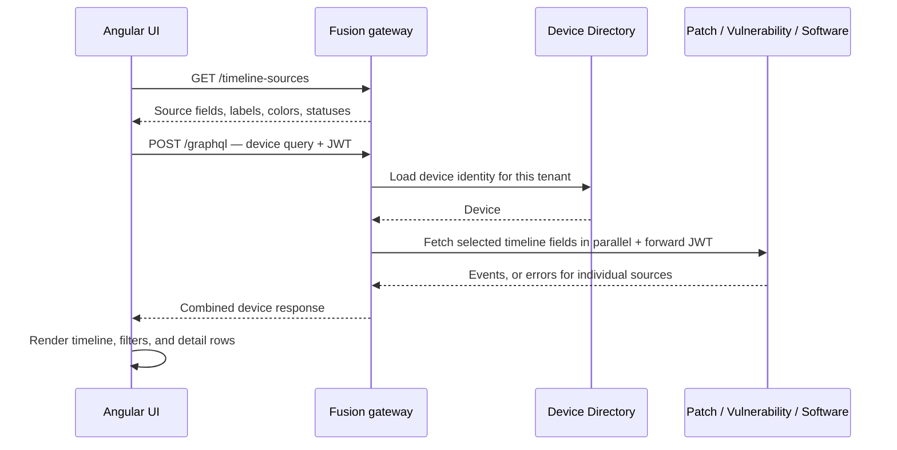
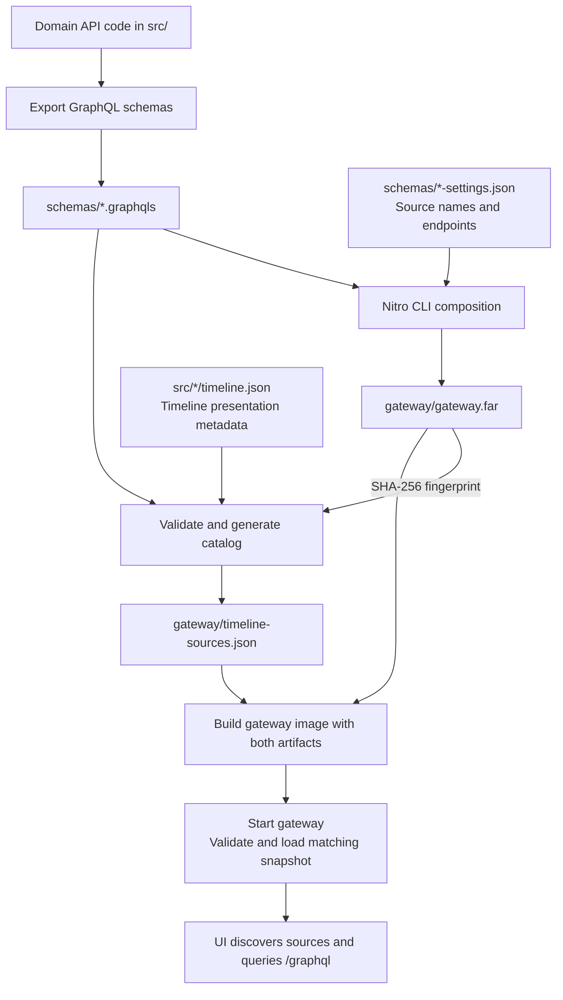

# SoR — One device, several systems, one GraphQL API

A device's identity, patches, vulnerabilities, and installed software usually live in different systems.
This System of Record (SoR) proof of concept brings those views together through **one API and one UI**,
while each service keeps ownership of its data.

Start with a device and explore its history, or start with a patch, CVE, or software product and find
which devices match. The sample includes **12,000 devices, two tenants, and five demo users**.

## What can this POC do?

| Try this                                     | What it demonstrates                                                                                                                                                                      |
| -------------------------------------------- | ----------------------------------------------------------------------------------------------------------------------------------------------------------------------------------------- |
| **Browse devices and open a timeline**       | Device identity from Device Directory, combined with patch, vulnerability, and software events from three independent services.                                                           |
| **Filter the timeline and inspect an event** | Date ranges, source/status/text filters, and details supplied by the owning service.                                                                                                      |
| **Find devices across domains**              | Queries such as “devices with this patch **AND** this CVE.” The server combines matches, sorts, and paginates; the browser receives the final page. **AND** takes precedence over **OR**. |
| **Switch demo users**                        | Tenant isolation and service permissions enforced on the server. A user cannot reveal another tenant's devices by changing the URL.                                                       |
| **Stop a domain service**                    | The timeline keeps healthy sections visible and distinguishes **unavailable** from **no access**.                                                                                         |
| **Add a compatible timeline source**         | New event types, labels, filters, and detail rows appear from server metadata, with **no UI code change or redeployment**.                                                                |
| **Inspect the GraphQL execution plan**       | The embedded Nitro IDE shows how one client query becomes calls to several services.                                                                                                      |

This is a read/query POC with deterministic sample data and development JWTs. It demonstrates federation,
permissions, failure handling, and extensibility; it does not ingest live product data or implement device
management actions. Timeline sections can degrade independently. A cross-domain **search** fails if a
required source cannot answer, so it never presents incomplete matches as a successful result.

## Run it and try it

You need **Git, Docker with Docker Compose, and Bash** (on Windows, use WSL). Docker builds the backend
and UI, so you do not need a host .NET or Node.js installation just to run the demo.

```bash
git clone https://github.com/chanakya-net/federated-graphQL.git
cd federated-graphQL
scripts/up.sh
```

The first run downloads images, builds the services, and seeds their stores; allow several minutes.
The committed `.env` contains **local-demo credentials only**.

Open **[the UI at localhost:4200](http://localhost:4200)**, then:

1. Select **Alice**, search for `dev-00001`, and open its timeline. Click an event to see its details.
2. Switch to **Bob**: Patch and Vulnerability remain visible, while Software Install shows no access.
3. Switch to **Dave**: that Tenant A device is not found in his Tenant B view.
4. Return to Alice and open **Find devices**. Combine a patch and a CVE with AND or OR.

The gateway is at [localhost:5050/graphql](http://localhost:5050/graphql); its
[Nitro IDE](http://localhost:5050/graphql/) lets you explore the schema and send queries.
For the IDE, generate a demo token and set the `Authorization` header to `Bearer <token>`:

```bash
docker compose run --rm -T token-generator --user alice
```

Useful controls, from the repository root:

```bash
docker compose ps                         # Check service health
docker compose logs fusion-gateway        # Diagnose startup or request failures
scripts/demo-outage.sh patch stop          # Watch the timeline handle an outage
scripts/demo-outage.sh patch restore       # Restore it, then refresh the timeline
docker compose down                       # Stop the stack; keep its data
scripts/reset.sh                          # Asks before deleting the seeded volumes
```

If ports are busy, run `GATEWAY_PORT=5051 UI_PORT=4201 scripts/up.sh`. For a guided walkthrough,
see the [10-minute demo](docs/demo.md).

## Technology and licenses

These are the main components used here. Versions come from the repository; license names were checked
against package license files and the linked upstream sources on **20 September 2026**.

| Technology                                                                     | Its job in this POC                                   | License                                                                                                                                                                                                                                                                                                            |
| ------------------------------------------------------------------------------ | ----------------------------------------------------- | ------------------------------------------------------------------------------------------------------------------------------------------------------------------------------------------------------------------------------------------------------------------------------------------------------------------ |
| C# / .NET 10, ASP.NET Core, EF Core                                            | Services, authentication, and relational data access  | MIT: [.NET](https://github.com/dotnet/runtime/blob/main/LICENSE.TXT), [ASP.NET Core](https://github.com/dotnet/aspnetcore/blob/main/LICENSE.txt), [EF Core](https://github.com/dotnet/efcore/blob/main/LICENSE.txt)                                                                                                |
| Hot Chocolate + Fusion **16.6.6**                                              | Domain GraphQL APIs and the federation gateway        | [MIT](https://github.com/ChilliCream/graphql-platform/blob/16.6.6/LICENSE)                                                                                                                                                                                                                                         |
| Nitro CLI **16.6.6**                                                           | Composes schemas into the FAR file                    | [MIT](https://github.com/ChilliCream/graphql-platform/blob/16.6.6/LICENSE)                                                                                                                                                                                                                                         |
| Embedded Nitro App **32.0.2**                                                  | Browser IDE for exploring GraphQL                     | [ChilliCream License 1.0](https://chillicream.com/licensing/chillicream-license) — separate from the CLI                                                                                                                                                                                                           |
| Angular / Angular Material **22**, Apollo Angular **14** / Apollo Client **4** | UI components and GraphQL requests                    | MIT: [Angular](https://github.com/angular/angular/blob/main/LICENSE), [Material](https://github.com/angular/components/blob/main/LICENSE), [Apollo Angular](https://github.com/kamilkisiela/apollo-angular/blob/master/LICENSE), [Apollo Client](https://github.com/apollographql/apollo-client/blob/main/LICENSE) |
| TypeScript **6**, RxJS **7**                                                   | UI language and asynchronous data flow                | Apache-2.0: [TypeScript](https://github.com/microsoft/TypeScript/blob/main/LICENSE.txt), [RxJS](https://github.com/ReactiveX/rxjs/blob/master/LICENSE.txt)                                                                                                                                                         |
| PostgreSQL **17**                                                              | Device Directory and Vulnerability stores             | [PostgreSQL License](https://www.postgresql.org/about/licence/)                                                                                                                                                                                                                                                    |
| MongoDB Community Server **8**                                                 | Patch store                                           | [SSPL-1.0](https://www.mongodb.com/legal/licensing/community-edition); the .NET driver is Apache-2.0                                                                                                                                                                                                               |
| Azurite (`latest` image)                                                       | Local Azure Blob Storage emulator for software events | [MIT](https://github.com/Azure/Azurite/blob/main/LICENSE)                                                                                                                                                                                                                                                          |
| Node.js **24**, Nginx (`alpine` image)                                         | Build the UI; serve it and proxy API requests         | [Node.js: MIT, with bundled third-party licenses](https://github.com/nodejs/node/blob/v24.x/LICENSE); [Nginx: BSD-2-Clause](https://github.com/nginx/nginx/blob/master/LICENSE)                                                                                                                                    |
| Docker Engine / Compose                                                        | Run the services and stores locally                   | Apache-2.0: [Engine](https://github.com/moby/moby/blob/master/LICENSE), [Compose](https://github.com/docker/compose/blob/main/LICENSE). [Docker Desktop has separate subscription terms](https://docs.docker.com/subscription-billing/desktop-license/).                                                           |

**The distinction to keep in mind:** the pinned Fusion runtime and Nitro CLI are MIT-licensed.
The embedded Nitro IDE has its own terms, and MongoDB Server uses SSPL. They should not all be described
as “MIT.” MIT, Apache, BSD, and PostgreSQL licenses are permissive; SSPL and the ChilliCream license have
additional conditions described in their linked texts.

This is a summary of the main dependencies, not a full dependency-license inventory. Exact package pins
are in [Directory.Packages.props](Directory.Packages.props) and [ui/package.json](ui/package.json).
**This repository currently has no `LICENSE` file for the POC's own source code**; dependency licenses
do not assign one to it.

## How it works

A **subgraph** is simply one service's GraphQL API. In this repo, Hot Chocolate exposes each domain's
API over its own store:

| Service          | Owns / does                                    | Storage                                   |
| ---------------- | ---------------------------------------------- | ----------------------------------------- |
| Device Directory | Device ID, hostname, OS, IP, tenant, last seen | PostgreSQL                                |
| Patch            | Patch catalog and patch events                 | MongoDB                                   |
| Vulnerability    | CVEs, findings, detection/remediation history  | PostgreSQL                                |
| Software Install | Software catalog and installation history      | Azurite blobs                             |
| Device Search    | Combines domain matches for AND/OR searches    | Calls domain APIs; no database of its own |

**Fusion** is the front door to these APIs. It uses a **FAR (Fusion Archive)** containing the combined
schema and the metadata needed to route requests. The domain services fetch the actual records when a
query runs. The UI talks to the gateway through Nginx and never connects to the databases.

### Opening a device timeline



Device Directory runs first because the other services extend its `Device`. Each domain checks the
forwarded user's permissions and tenant. A nullable timeline field lets one denied or unavailable
source produce a section message while the other sections still render. If Device Directory is down,
the device page cannot load.

For **Find devices**, the order changes: Fusion calls Device Search, which asks the selected domains
for matching device IDs, evaluates the AND/OR expression, and fetches the selected page's events.
Fusion then fills in device names and other identity fields from Device Directory. These filters match
historical events/findings; they are not a guarantee of current installed state. Pages are fresh reads,
not a snapshot shared across services.

### From API code to FAR to deployment

There are two stages: **build the gateway's map**, then **use that map to serve live queries**.
[Composition](https://chillicream.com/docs/fusion/cli) combines the source schemas before deployment;
it is not something the browser performs.



Run this whenever a subgraph's GraphQL schema or timeline descriptor changes:

```bash
scripts/compose-schema.sh
```

The script exports schemas from the .NET projects **without starting their databases**, discovers the
schemas paired with `*-settings.json`, and runs the pinned `dotnet nitro fusion compose` command.
It creates a fresh FAR, then validates timeline descriptors and writes the catalog with that FAR's
SHA-256 fingerprint. Composition needs no Nitro Cloud account; the first package/tool restore may
need internet access.

Review and commit **`schemas/` plus both files in `gateway/`** together. To deploy a Patch change to the
local stack, for example:

```bash
docker compose up -d --build patch fusion-gateway
scripts/wait-healthy.sh patch fusion-gateway
```

The gateway Dockerfile **copies the generated artifacts** into its image; it does not compose schemas.
At startup, the gateway validates the schema/catalog pair and registers clients using
`SUBGRAPH_<SOURCE_NAME_UPPER>_URL`. A missing URL, invalid catalog, or mismatched FAR prevents startup.
Deploy both artifacts in the same gateway image and **recreate/restart the gateway**. This POC keeps an
immutable snapshot for that process; replacing a file underneath a running gateway does not reload it.

CI checks schema drift, backend tests, and the UI build/tests. It does **not** currently publish images
or deploy to a hosted environment. `scripts/compose-schema.sh --no-export` recomposes existing schema
files; `scripts/check-schema-drift.sh` verifies that regenerated artifacts match the committed versions.

### Adding another domain

For a new **timeline source**, expose the shared `TimelineEvent`/`TimelineDetail` shape, add its
`timeline.json` descriptor and schema settings, and configure/deploy the new service. Recompose and
redeploy the gateway as above. On navigation, user change, or Retry, the existing UI reloads the catalog
and builds its query and display from it. The gateway's public URL stays the same.

This works for sources that fit the existing timeline contract. A new kind of UI control or layout
still needs UI work. Adding a **search** category is a separate backend step: implement and register a
Device Search provider. The existing finder handles providers using its standard catalog picker.
See the [timeline source guide](docs/timeline-sources.md) and [search provider guide](docs/search-providers.md).

## Build and test while developing

For host builds, install **.NET SDK 10.0.400** (or a compatible later 10.0 feature band) and
**Node.js 24.15+ in the 24.x line**. Docker is needed for integration tests. From the repository root:

```bash
dotnet tool restore          # Pinned Nitro CLI, also used by composition tests
scripts/build.sh             # Release backend build; restores packages
scripts/test.sh unit         # Backend tests that do not require Docker
scripts/test.sh              # Full backend suite, including Docker integration tests
```

The test script uses `--no-build`, so build first. The full suite includes gateway outage tests against
the local Compose stack; run it when a brief interruption of the demo is acceptable.

```bash
cd ui
npm ci
npm test
npm run build
npm run start:live           # UI dev server on :4300, using the running :5050/:4200 stack
```

For UI-only development without Docker, run `npm run mock` in one terminal and `npm start` in another,
both from `ui/`. For the deployed stack, run `scripts/e2e.sh` from the repo root after `scripts/up.sh`
(requires `curl` and `jq`). It checks federation, permissions, tenant isolation, date filters, search,
and outages, and restores the services it stops. See the [verification report](docs/e2e-report.md).

## Where to go next

| If you want to…                                       | Read / open                                                                                      |
| ----------------------------------------------------- | ------------------------------------------------------------------------------------------------ |
| Give a short demo                                     | [Demo runbook](docs/demo.md)                                                                     |
| Add a timeline source or search category              | [Timeline sources](docs/timeline-sources.md) · [Search providers](docs/search-providers.md)      |
| Understand schema, auth, and error contracts          | [Contracts](contracts/README.md)                                                                 |
| Check version-specific behavior and known limitations | [Version facts](docs/version-facts.md) — takes precedence over older phase plans                 |
| Explore the implementation                            | `src/` for services, `ui/` for the client, `tests/` for backend tests                            |
| Revisit the original design                           | [POC plan](federated-graphql-poc-plan.md) · [Implementation phases](phases/00-execution-plan.md) |
