# Federated GraphQL POC: Overview for Architects

A short summary of what this proof of concept (POC) tries to prove, how it is built, what it uses, and where it stops.
The full plan is in [`federated-graphql-poc-plan.md`](../federated-graphql-poc-plan.md). Exact versions and verified commands are in [`version-facts.md`](version-facts.md).

## 1. The goal in one paragraph

Three teams each own one kind of data about the same devices: **Patch**, **Vulnerability** and **Software Install**. Each domain lives in its own service with its own database. The POC puts **one GraphQL API** in front of all three, so a client can ask for a device and its full history in a single query, as if it all came from one place. It also has to work in a system with several tenants and per-user permissions, and it has to keep working when one of the domains is down.

## 2. What the POC must prove

| # | Claim | How we show it |
|---|---|---|
| 1 | **Real federation, not just an aggregator.** Independent services each add fields to one shared `Device` type, joined on `deviceId`. | The gateway plans the query, loads the device first, then calls the three domains in parallel and merges the results. |
| 2 | **Different databases behind the same API.** | Patch runs on MongoDB, Vulnerability and Device Directory on PostgreSQL, Software Install on Azure Blob storage (run locally with Azurite). |
| 3 | **Tenant isolation.** A user never sees another tenant's data. | Each service filters by the `tenantId` in the caller's token. A device from another tenant simply returns "not found". |
| 4 | **Per-user access to each domain.** For example, Bob can see Patch and Vulnerability but not Software Install. | Each domain service checks the `services` list in the token. The gateway and the UI make no access decisions. |
| 5 | **Partial failure.** If one domain is down or hangs, the rest of the page still works. | The failed section comes back empty with an error. The others load normally. |
| 6 | **The user can tell "down" from "no access".** | Denials carry the error code `AUTH_NOT_AUTHORIZED`. The UI shows a lock icon for a denial and a warning banner for an outage. |
| 7 | **Runs locally with one command.** | `docker compose up --build`. No cloud account, no manual steps, works offline. |

## 3. Architecture



```
Angular UI ──JWT──▶ Fusion Gateway ──┬──▶ Device Directory ──▶ PostgreSQL
                                     ├──▶ Patch            ──▶ MongoDB
                                     ├──▶ Vulnerability    ──▶ PostgreSQL
                                     └──▶ Software Install ──▶ Azure Blob (Azurite)
```

**How a request flows**

1. The UI sends one GraphQL query with the user's token: *"device X, with its patch, vulnerability and install events"*.
2. The **gateway** checks only that the token is valid (signature and expiry). It forwards the token unchanged and reads no tenant or permission data.
3. The gateway asks **Device Directory** for the device, then calls the three domain services **in parallel**.
4. **Each domain service** checks two things on its own: does this user have access to this domain, and does the device belong to the user's tenant?
5. The gateway merges the answers into one response. If a domain failed or refused, only that section is `null`, and `errors[]` says why.

**Key design decisions**

- **Security is enforced in each service, not at the edge.** A service stays safe even if it is called directly or the gateway is misconfigured. The spike confirmed that the Fusion gateway does not enforce authorization rules itself, so the services must.
- **Access checks sit on the field, not the whole endpoint.** A denial then comes back as a normal GraphQL error with a clear code. If the whole endpoint returned 403, the gateway could not tell it apart from an outage.
- **Domain fields are nullable on purpose.** In GraphQL, an error on a required field wipes out its parent object. Making the three domain fields optional keeps an outage or a denial inside that one section. A test stops anyone from making them required again.
- **Short per-service timeouts (5 s).** A hung service turns into an error after a few seconds instead of blocking the whole page.
- **The combined schema is built ahead of time and committed.** A script combines the four service schemas into one gateway file (`gateway.far`). A drift check fails the build if that file is out of date.
- **Seed data is deterministic.** There are 12,000 devices (`dev-00000` to `dev-11999`): 7,000 in Tenant A and 5,000 in Tenant B. IDs and tenants come from the index number, not a random generator, so all four services agree on the same devices.

**Demo users**

| User | Tenant | Can see | What it demonstrates |
|---|---|---|---|
| alice | A | Patch, Vulnerability, Software Install | Full access |
| bob | A | Patch, Vulnerability | Partial access: Software Install shows "no access" |
| carol | A | Software Install | Single domain |
| dave | B | all three | Tenant isolation: Tenant A devices are invisible to him |
| erin | B | Patch | Minimal access |

## 4. Technologies and licenses

| Area | Technology (version) | License | Link |
|---|---|---|---|
| Runtime | .NET 10 / ASP.NET Core 10 | MIT | [dotnet.microsoft.com](https://dotnet.microsoft.com/) |
| GraphQL services | Hot Chocolate 16.6.6 | MIT | [chillicream.com/docs/hotchocolate](https://chillicream.com/docs/hotchocolate) |
| GraphQL gateway | Hot Chocolate Fusion 16.6.6 (Fusion v2) | MIT | [chillicream.com/docs/fusion](https://chillicream.com/docs/fusion) |
| Federation standard | GraphQL Composite Schemas spec (`@lookup`, `@internal`), implemented by Fusion v2 | Open spec (GraphQL Foundation) | [github.com/graphql/composite-schemas-spec](https://github.com/graphql/composite-schemas-spec) |
| Schema composition | Nitro CLI 16.6.6 (`dotnet tool`), used offline only | Free ChilliCream tool. Verified to work offline with no login | [chillicream.com/docs/nitro](https://chillicream.com/docs/nitro) |
| Auth (dummy) | ASP.NET Core JWT Bearer 10.0.12, HS256 tokens | MIT | [github.com/dotnet/aspnetcore](https://github.com/dotnet/aspnetcore) |
| Database | PostgreSQL 17 | PostgreSQL License (permissive) | [postgresql.org](https://www.postgresql.org/about/licence/) |
| Database access | EF Core 10 + Npgsql 10 | MIT / PostgreSQL License | [github.com/dotnet/efcore](https://github.com/dotnet/efcore), [npgsql.org](https://www.npgsql.org/) |
| Database | MongoDB Community Server 8 | **SSPL v1** (free to self-host, not OSI-approved) | [mongodb.com licensing](https://www.mongodb.com/legal/licensing/community-edition) |
| Database access | MongoDB C# Driver 3.12 | Apache 2.0 | [github.com/mongodb/mongo-csharp-driver](https://github.com/mongodb/mongo-csharp-driver) |
| Blob storage | Azurite (local Azure Storage emulator) | MIT | [github.com/Azure/Azurite](https://github.com/Azure/Azurite) |
| Blob access | Azure.Storage.Blobs 12.29 | MIT | [github.com/Azure/azure-sdk-for-net](https://github.com/Azure/azure-sdk-for-net) |
| UI framework | Angular 22 + Angular Material 22 | MIT | [angular.dev](https://angular.dev/), [material.angular.dev](https://material.angular.dev/) |
| UI GraphQL client | Apollo Angular 14 / Apollo Client 4 | MIT | [the-guild.dev/graphql/apollo-angular](https://the-guild.dev/graphql/apollo-angular) |
| Web server | Nginx (serves UI, proxies `/graphql`) | BSD-2-Clause | [nginx.org](https://nginx.org/LICENSE) |
| Test data | Bogus 35.6 (hostnames, OS names and similar) | MIT | [github.com/bchavez/Bogus](https://github.com/bchavez/Bogus) |
| Testing | xUnit 2.9, Testcontainers for .NET 4.15 | Apache 2.0 / MIT | [xunit.net](https://xunit.net/), [dotnet.testcontainers.org](https://dotnet.testcontainers.org/) |
| Local runtime | Docker + Docker Compose | Engine: Apache 2.0. **Docker Desktop is paid** for companies with more than 250 employees or more than $10M revenue | [Docker Desktop license](https://docs.docker.com/subscription/desktop-license/) |

**License notes**

- Everything in the runtime path is MIT or a permissive license, **except MongoDB (SSPL)**. SSPL is fine for self-hosting. It matters only if you offer MongoDB itself as a hosted service.
- **ChilliCream's Nitro platform** (hosted observability and schema registry) is commercial and **not used**. Only the free CLI is used, and only to combine schemas.
- FluentAssertions was **deliberately not used**, because its license changed to commercial in v8.

## 5. Limitations and non-goals

**Out of scope on purpose**

- **Auth is fake.** Tokens are signed with a shared development key committed in `.env`. The five users are a static list and tokens are long-lived. There is no real identity provider (no Entra ID, no OAuth flow).
- **Permissions are coarse.** Access is granted per user and per domain. There are no permissions per device or per record.
- **Single machine only.** No scaling, high availability or cloud deployment. Everything runs in Docker Compose.
- **No production monitoring.** There is no tracing or metrics stack. The Nitro UI query-plan view is used only for demos.
- **No real paging.** Timeline events can only be filtered by date range (`since` / `until`).
- **Synthetic data.** 12,000 generated devices. No load or performance testing.

**Known constraints of the design**

- **Device Directory is a single point of failure.** It owns the `Device` record the other services attach data to. If it is down, the whole query fails. The partial-failure guarantee covers only the three domain services.
- **Schema changes need a manual rebuild step.** After any service schema change, you must re-run `scripts/compose-schema.sh` and commit the result. CI catches it if you forget.
- **Hot Chocolate's federation tooling changes quickly.** It changed a lot between v14, v15 and v16 (Fusion v1 to v2, `.fgp` to `.far`, new CLI). Versions are pinned exactly, and upgrades should be treated as a small project.
- **Gateway settings are easy to get wrong.** Fusion does not forward the `Authorization` header or set sensible timeouts by default. Both are set explicitly here. Without them, every service sees an anonymous caller and waits up to 100 seconds.

## 6. Status (2026-09-18)

| Phase | Scope | State |
|---|---|---|
| 0 | Spike: proves partial failure, denial codes, header forwarding and offline composition | Done: all assumptions held |
| 1–2 | Scaffold, token generator, Device Directory, Docker Compose infrastructure | Done |
| 3 | Patch (MongoDB), Vulnerability (PostgreSQL), Software Install (Azurite) services | Done |
| 4 | Fusion gateway, schema composition, drift check | Done |
| 5 | Angular UI: timeline, user switcher, ok / no-access / unavailable states | In progress |
| 6 | End-to-end validation: stop and pause each service, run each demo user | Not started |
