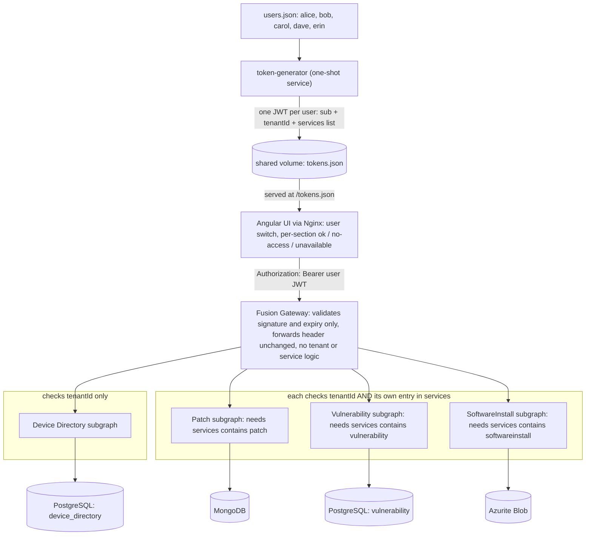

# Federated GraphQL POC — Architecture & Component Plan (v3)

> **Revision 3.** Adds **per-user service access**: each dummy user carries a `services` claim, and every domain subgraph enforces it on its own fields, independently of tenant isolation. The token generator now mints per-user tokens (not per-tenant). Architecture diagram rebuilt with plain Mermaid syntax and a static SVG fallback. See §10 for the full change list.

## 1. Problem Statement

Build a proof-of-concept for a **federated GraphQL graph** (using ChilliCream Hot Chocolate / Fusion on .NET) that unifies data from three independent domains — **Patch management**, **Vulnerability management**, and **Software Install** — behind a single GraphQL gateway.

The system must:

- Represent each domain as an independently deployable GraphQL **subgraph**, each backed by a different database technology (MongoDB, PostgreSQL, Azure Blob/Azurite). Fusion federates GraphQL *subgraphs* and is completely blind to what backs each one; the point of using different stores is to prove **we** can build subgraphs over heterogeneous stores and federate them uniformly — not that Fusion "sees" the heterogeneity.
- Use **`deviceId`** as the common key that ties data across all three domains together into one entity (`Device`).
- Support **multi-tenancy**: data is partitioned across two tenants (Tenant A ≈ 7,000 devices, Tenant B ≈ 5,000 devices; 12,000 total). Every subgraph independently validates the caller's JWT and enforces the `tenantId` claim — no subgraph may return another tenant's data.
- Support **per-user service access** (authorization, separate from tenancy): a user may be entitled to some domains and not others — e.g. User 1 can see Patch and Vulnerability but **not** Software Install. The check is done **at each subgraph**, from a `services` claim in the user's JWT; neither the gateway nor the UI decides access. A user without access to a domain sees that section of the timeline as "no access", while the sections they are entitled to still render.
- Ship **dummy users, not just dummy tenants**: the token generator mints one JWT per dummy user, each carrying `sub`, `tenantId`, and a `services` list. At least one user per tenant has full access, and at least one has partial access (see §4.4 for the five seeded users), so the per-service check can be demonstrated end-to-end.
- Provide an **Angular UI** where a user picks a device and sees a merged, filterable **timeline** of everything that happened to it (patches applied, vulnerabilities found/remediated, software installed), sourced transparently from the three subgraphs.
- Be **resilient to partial outages**: if one domain subgraph is down, the rest of the system keeps working, the gateway returns whatever data it can, and the UI clearly tells the user which part of the timeline is missing and why — and distinguishes "service down" from "you don't have access".
- Run entirely locally via containers, started with a **single `docker compose up --build`** — no cloud accounts, no external dependencies, **no manual pre-steps**.

This document is the reference plan: what each component is, what it's built with, what it's responsible for, and how the pieces fit together.

## 2. Goals / Non-Goals

**Goals**
- Demonstrate real federation (entity extension across subgraphs keyed on `deviceId`), not just API aggregation.
- Demonstrate per-tenant data isolation enforced at the subgraph level.
- Demonstrate **per-user, per-service authorization** enforced at the subgraph level, orthogonal to tenancy.
- Demonstrate graceful degradation when a domain subgraph is unavailable — **both** when it is stopped (fast connection failure) **and** when it is hung (timeout path).
- Keep everything self-hosted, free/open-source where possible, and runnable offline.

**Non-Goals (for this POC)**
- No real identity provider / production-grade auth (tokens are dummy, HS256, dev-only; users are a static list).
- No production-grade observability stack (Nitro's paid observability platform is out of scope; see §8).
- No horizontal scaling, HA, or cloud deployment — single-node Docker Compose only.
- No server-side pagination of timeline events beyond simple date-range arguments (§4.2).
- No fine-grained (per-device or per-record) permissions — access is per user, per domain service.

## 3. High-Level Architecture



The client only ever talks to the **Fusion Gateway**. The gateway does two things with the token: (1) validates its signature and expiry so unauthenticated requests are rejected at the edge with a clean 401 instead of fanning out and producing four confusing transport errors; (2) forwards the `Authorization` header **unchanged** to every subgraph. The gateway performs **no tenant or service-access logic** — each subgraph independently reads the `tenantId` and `services` claims and enforces both. Header forwarding is **not** automatic in Fusion and must be configured explicitly (§4.3).

Two independent checks happen in every domain subgraph, in this order:

1. **Service access** — does the caller's `services` claim include this subgraph's service name? If not, the subgraph's fields return an authorization error (the field is `null`, the error carries `extensions.code = "AUTH_NOT_AUTHORIZED"`).
2. **Tenant scoping** — every query is filtered by the caller's `tenantId` claim. Another tenant's device simply does not exist from this caller's point of view.

## 4. Components

### 4.1 Data Stores

| Component | Technology | License | Used by | Purpose |
|---|---|---|---|---|
| MongoDB | MongoDB Community Server | SSPL (free to self-host; not OSI-approved; restricts offering MongoDB itself as a hosted service) | Patch Subgraph | Patch catalog and per-device patch application events (applied / failed / pending), tagged with `deviceId` and `tenantId`. |
| PostgreSQL | PostgreSQL | PostgreSQL License (permissive) | Device Directory Subgraph, Vulnerability Subgraph | One container, **two schemas, two database roles**. `device_directory` schema (role `devdir_user`) holds device metadata; `vulnerability` schema (role `vuln_user`) holds the CVE catalog and per-device findings. Each role is granted only its own schema, so neither subgraph can read the other's tables. Sharing the instance is a normal deployment pattern and does not undercut independent deployability; splitting into two containers later is a Compose-file change only. |
| Azurite | Microsoft Azure Storage Emulator | MIT | SoftwareInstall Subgraph | Local Azure Blob emulator. Install/uninstall events stored **one blob per device** at `{tenantId}/{deviceId}/installEvents.json`, so tenant + device isolation is structural (prefix-based) and each device query is a single GET. See §6. **Connection string gotcha:** `UseDevelopmentStorage=true` only resolves to `127.0.0.1` and will fail across containers. Use an explicit connection string with `BlobEndpoint=http://azurite:10000/devstoreaccount1` and the well-known Azurite account key. |

### 4.2 Subgraph Services (all Hot Chocolate / .NET / MIT)

| Subgraph | Service name (`services` claim) | Owns | Key responsibilities |
|---|---|---|---|
| **Device Directory** | *(none — any valid token)* | `Device { id, hostname, os, ipAddress, lastSeenAt, tenantId }` | Canonical, searchable device list. Exposes the **public** `device(id)` / `devices(search, first)` queries and the entity's public `@lookup`. Every other subgraph extends this entity but does not expose it publicly. Requires an authenticated caller and scopes by tenant; no service-access check, because every user needs the device list to do anything. (Adding a `devices` service name later is a one-line policy change.) |
| **Patch** | `patch` | Patch catalog + `patchEvents` per device | Extends `Device` with a **nullable** `patchEvents(since: DateTime, until: DateTime): [PatchEvent!]`, guarded by the `patch` service policy. Lookup `deviceById(id: ID!): Device @lookup @internal` — not client-callable, exists only so the gateway can attach this subgraph's data to a `Device` resolved by Device Directory. |
| **Vulnerability** | `vulnerability` | CVE catalog + `vulnerabilityEvents` per device | Extends `Device` with **nullable** `vulnerabilityEvents(since, until): [VulnerabilityEvent!]` (detected / remediated), guarded by the `vulnerability` policy. Internal lookup as above. |
| **SoftwareInstall** | `softwareinstall` | `installEvents` per device (Azurite) | Extends `Device` with **nullable** `installEvents(since, until): [InstallEvent!]`, guarded by the `softwareinstall` policy, reading the blob at `{tenantId}/{deviceId}/installEvents.json`. Internal lookup as above. |

> **⚠️ Nullability is load-bearing — this is the mechanism behind §7 *and* behind per-service authorization.** The three extension fields are **nullable lists** (`[PatchEvent!]`, not `[PatchEvent!]!`) on purpose. When a **non-null** field errors — which is what both a down subgraph *and* an authorization denial produce — GraphQL null-propagation walks up to the nearest nullable parent. If `patchEvents` were non-null, a Patch outage *or* a user without `patch` access would null out the *entire* `device` and take the other two sections with it. Nullable extension fields stop propagation at the field itself. Do **not** "tighten" these to non-null later. Add a code comment on each field and a schema-snapshot test that fails if any of the three becomes non-null.

Design notes that apply to every subgraph:

- **Service-access authorization lives on the field, not the HTTP endpoint.** Each domain subgraph registers one ASP.NET Core policy and applies it with Hot Chocolate's `[Authorize]` attribute to its extension field and to any public root fields it owns:
  ```csharp
  // Patch subgraph, Program.cs
  builder.Services.AddAuthorization(o =>
      o.AddPolicy("ServiceAccess", p => p
          .RequireAuthenticatedUser()
          .RequireClaim("services", "patch")));

  builder.Services.AddGraphQLServer()
      .AddAuthorization()
      // ...types

  // Device type extension
  [Authorize(Policy = "ServiceAccess")]
  public Task<IReadOnlyList<PatchEvent>?> GetPatchEventsAsync(...) { ... }
  ```
  Because the JWT's `services` claim is an array, .NET surfaces it as multiple `services` claims and `RequireClaim("services", "patch")` matches any of them. Putting the policy on the **field** (rather than `RequireAuthorization()` on `/graphql`) matters: an endpoint-level 403 would reach the gateway as a *transport* failure, indistinguishable from an outage. A field-level denial produces a proper GraphQL error — `patchEvents: null` plus an `errors[]` entry at `["device","patchEvents"]` with `extensions.code = "AUTH_NOT_AUTHORIZED"` — which the gateway forwards and the UI can label correctly (§7).
- **Lookups are tenant-scoped too.** `deviceById` in each domain subgraph filters on `deviceId` **and** the token's `tenantId` claim. The lookup itself is *not* behind the service policy (the policy is on the extension field); a denied user still resolves the entity, then gets `null` + an auth error on the field. This keeps the error at the field the user asked for.
- **Date-range arguments.** `since` / `until` on the three extension fields let the UI push its date filter server-side instead of downloading a device's full history. Both optional; omitted means unbounded.
- **Batch lookup (optional).** The single-device timeline only needs `deviceById`. If the UI ever shows a device *list* with per-device counts, add a list-form lookup `devicesById(ids: [ID!]!): [Device]` so the gateway batches instead of issuing N calls. Not needed for the POC scope.
- **Seeding runs in an `IHostedService`, never inline in `Program.cs`.** Schema export (§4.3) constructs the DI container without a database present; any migration or seed executed before `app.Run()` breaks the build. The hosted service seeds on startup, and the `/health` endpoint reports unhealthy until seeding finishes.
- **JWT Bearer authentication** via standard ASP.NET Core middleware (§5). Tenant scoping and service access are enforced from the validated claims only — never from a client-supplied value.

### 4.3 Fusion Gateway

- **Technology:** Hot Chocolate Fusion (MIT). Composed from each subgraph's **exported source schema** using the **Nitro CLI** (`ChilliCream.Nitro.CommandLine`, a `dotnet tool` used purely for local, offline schema composition — distinct from ChilliCream's paid Nitro observability SaaS).
- **⚠️ Pin versions.** Hot Chocolate's federation story and composition tooling (Fusion v1 → v2, `.fgp` → `.far`, `dotnet fusion` → `nitro fusion`) have shifted across HC 14 → 15 → 16. Pin exact NuGet and `dotnet tool` versions in a single `Directory.Packages.props` + `dotnet-tools.json`, and verify every command in this document against *that version's* docs. Command names below are illustrative and may be stale.
- **⚠️ Confirm the CLI composes offline with no login prompt** on the pinned version. If it ever becomes account-gated, the composition library `HotChocolate.Fusion.Composition` is itself MIT and can be driven from a ~30-line console project instead.

**Composition inputs and workflow.** Build-time composition cannot introspect running subgraphs. Instead:

1. Each subgraph exports its SDL with Hot Chocolate's built-in command (no database required, see §4.2):
   ```
   dotnet run --project src/DeviceDirectory -- schema export --output schemas/device-directory.graphqls
   ```
2. A root-level script `scripts/compose-schema.sh` runs the export for all four subgraphs, then composes:
   ```
   nitro fusion compose --source-schema-file schemas/*.graphqls --archive gateway/gateway.far
   ```
   (Exact flags and how subgraph URLs are supplied — settings file vs. flag — must be confirmed against the pinned version.)
3. **The exported `schemas/*.graphqls` files and the composed `gateway.far` are committed to the repo.** The gateway Dockerfile simply `COPY`s the archive. This keeps the gateway image build self-contained and fast, and makes schema drift visible in code review.
4. **Stale-artifact guard:** a CI step (or pre-commit hook) re-runs `compose-schema.sh` and fails on `git diff --exit-code schemas/ gateway/gateway.far`. A stale artifact otherwise produces confusing "field not found / not composed" failures at runtime.

**Responsibilities:**
- Exposes the single public GraphQL endpoint (only this container's port is published to the host, alongside the UI).
- **Validates the JWT at the edge** — signature (shared dev key) and expiry only, via the same ASP.NET Core JWT Bearer middleware as the subgraphs. The GraphQL endpoint requires an authenticated principal; the built-in Nitro UI is mapped on a separate path (`/nitro`) so the browser can still load it. **No `tenantId` or `services` claim is read or acted on here.**
- **Forwards the `Authorization` header unchanged to every subgraph call.** Configured through the subgraph `HttpClient` pipeline (a `DelegatingHandler` copying the header from `IHttpContextAccessor`, or the version's equivalent). If skipped, every subgraph returns 401 and the failure looks like a tenancy bug — the spike (§9, Phase 0) verifies a subgraph actually receives the header.
- **Forwards subgraph GraphQL errors, including `extensions`, to the client.** The UI relies on `extensions.code` to tell "no access" from "unavailable" (§7). Phase 0 confirms the pinned Fusion version passes subgraph error extensions through unchanged.
- Loads the composed `.far` at startup; plans and executes distributed queries. For `device(id) { patchEvents vulnerabilityEvents installEvents }` it resolves `Device` via Device Directory first, then fans out to the three domain subgraphs in parallel and merges.
- **Per-subgraph timeouts:** each subgraph `HttpClient` gets a short `Timeout` (start at 5 s). A stopped container fails fast (DNS / connection refused); a *hung* container only fails via this timeout. **Verify in the spike that an `HttpClient` timeout surfaces as a field-level error, not as a cancellation of the whole gateway operation** — `TaskCanceledException` from a client timeout must not be mistaken for the caller cancelling the request.
- **Error handling mode:** Fusion v2 exposes an error-handling mode (propagate / null / halt or similar). Use the mode that yields standard GraphQL null-propagation so §7 holds, and record the chosen value next to the version pin.

### 4.4 Token Generator (Dummy Auth) — a one-shot Compose service

- **Technology:** small standalone .NET console app.
- **Purpose:** mints one self-signed HS256 JWT **per dummy user**, signed with the **shared dev-only symmetric key** that every service reads from the same `.env` variable (`DEV_JWT_SIGNING_KEY`). The key is a fixed, committed value — this is a POC, and a fixed key is what makes the tokens stable across rebuilds.
- **Users are a static, committed list** (`TokenGenerator/users.json`), so adding a scenario is a one-line edit:

  | `sub` | `name` | `tenantId` | `services` | Exercises |
  |---|---|---|---|---|
  | `alice` | Alice (Tenant A) | `TenantA` | `patch`, `vulnerability`, `softwareinstall` | Full access baseline |
  | `bob` | Bob (Tenant A) | `TenantA` | `patch`, `vulnerability` | **Partial access** — Software Install section must show "no access" while the other two render |
  | `carol` | Carol (Tenant A) | `TenantA` | `softwareinstall` | Single service |
  | `dave` | Dave (Tenant B) | `TenantB` | `patch`, `vulnerability`, `softwareinstall` | Full access in the other tenant — cross-tenant isolation test |
  | `erin` | Erin (Tenant B) | `TenantB` | `patch` | Minimal access |

- **Token payload** (illustrative):
  ```json
  {
    "sub": "bob",
    "name": "Bob (Tenant A)",
    "tenantId": "TenantA",
    "services": ["patch", "vulnerability"],
    "iat": 1758000000,
    "exp": 2000000000
  }
  ```
  `services` is a JSON array; ASP.NET Core's JWT handler exposes it as multiple claims of type `services`, which is what the subgraph policies match on (§4.2).
- **Runs inside Compose, not by hand.** The service `token-generator` has `restart: "no"`, writes `tokens.json` into a named volume, and exits 0. `tokens.json` is an array of `{ sub, name, tenantId, services, token }` objects — the UI uses everything but `token` for display and `token` for the interceptor. The UI container mounts the same volume read-only and Nginx serves it at `/tokens.json`. `angular-ui` declares `depends_on: token-generator: condition: service_completed_successfully`. This keeps the single-command promise honest.
- **Long expiry.** Set `exp` years out. A short-lived token makes the demo fail with confusing 401s the next day.
- The console app can still be run directly for ad-hoc tokens, e.g. to paste into the Nitro UI:
  ```
  dotnet run --project TokenGenerator -- --user bob
  dotnet run --project TokenGenerator -- --tenant TenantB --services patch,softwareinstall
  ```

### 4.5 Angular UI

| Aspect | Detail |
|---|---|
| Framework | Angular (current LTS), MIT |
| Component library | Angular Material, MIT |
| GraphQL client | Apollo Angular, MIT |
| Screens | (1) **User switch** — dropdown populated from `/tokens.json`, showing each user's name, tenant and services; an HTTP interceptor attaches the selected user's JWT. (2) Device list/search — queries Device Directory (via gateway) by hostname / ID / OS. (3) Device timeline — single gateway query requesting **all three** extension fields regardless of the user's entitlements, with `since`/`until` pushed server-side; results merged client-side into one chronological list. |
| Filters on timeline | Event type (Patch / Vulnerability / SoftwareInstall, multi-select), date range, status/outcome (Success / Failed / Pending, Open / Remediated), free-text search. |
| **Error policy (critical)** | **The timeline query must use `errorPolicy: 'all'`.** Apollo's default policy is `'none'`, which treats any entry in `errors[]` as a failure and **discards `data` entirely** — neither the degraded-state UI nor the no-access UI would ever see the partial response. With `'all'`, both `data` and `errors` are delivered to the component. |
| Degraded / denied handling | For each of the three sections, find the `errors[]` entry whose `path` **starts with** `["device", "<field>"]` (prefix match, not equality). Then: if `extensions.code === "AUTH_NOT_AUTHORIZED"` → render a **"no access"** state for that section; any other error → render an **"unavailable"** banner. Sections with no matching error render normally. The two states must look different (lock icon vs. warning icon) so the demo makes the distinction obvious. |
| Why always request all three | The UI deliberately does **not** pre-filter the query by decoding the JWT's `services` claim. Requesting everything and letting the subgraphs deny is what proves enforcement is server-side. (An optional client-side hint — greying out the section header from the decoded claim — is fine as polish, but the server response remains the source of truth.) |
| Networking | Served via its own Nginx container, which reverse-proxies `/graphql` to the gateway container — no CORS configuration. For local `ng serve`, a `proxy.conf.json` does the same. |

### 4.6 Docker Compose Orchestration

- One `docker-compose.yml` defining: `mongo`, `postgres`, `azurite`, `device-directory`, `patch`, `vulnerability`, `software-install`, `fusion-gateway`, `token-generator`, `angular-ui`.
- Internal-only Docker network for databases and subgraphs; only `fusion-gateway` and `angular-ui` publish ports.
- Startup order via `depends_on` + healthchecks: databases healthy → subgraphs seed and become healthy → gateway (pre-composed) starts → token generator completes → UI starts.
- **Healthcheck gotchas:**
  - The official `mcr.microsoft.com/dotnet/aspnet` image ships **without `curl` or `wget`**, so a naive `CMD curl -f http://localhost:8080/health` healthcheck silently fails. Either use the `-alpine` variant (busybox `wget` is present) or add `curl` in the Dockerfile.
  - Seeding 12k devices plus domain events runs *before* a subgraph reports healthy. Set `start_period` generously (start at 120 s) or Compose marks the container unhealthy and the gateway never starts.
- **Composition is not part of the image build.** `scripts/compose-schema.sh` is a developer / CI step (§4.3); the committed `.far` is what the gateway image copies. Document loudly: **after any subgraph schema change, run the script and commit the result.**
- Single command to run everything: `docker compose up --build`. No pre-steps.

## 5. Multi-Tenancy and Service Access

Two orthogonal authorization dimensions, both carried in the JWT and both enforced **per subgraph**:

| Dimension | Claim | Enforced where | Effect when it fails |
|---|---|---|---|
| Tenant isolation | `tenantId` | Every query and lookup in every subgraph, as a data filter | The record does not exist for this caller: `device` is `null`, **no error** (no existence leak) |
| Service access | `services` (array) | The extension field and public root fields of each domain subgraph, via an authorization policy | Field is `null` with an `errors[]` entry, `extensions.code = "AUTH_NOT_AUTHORIZED"`, path at that field |

- **Tenants:** Tenant A (7,000 devices) and Tenant B (5,000 devices). Assignment is a pure function of device index (§6) — no RNG, no runtime lookup between services.
- **Every row / blob** in every store carries `tenantId`, including Device Directory's own device list, so a tenant can never enumerate another tenant's device IDs.
- **Users:** the static list in §4.4. Access is per user, per domain service; there is no per-device or per-record permission model.
- **Token flow:** Client → Gateway (validates signature + expiry, rejects with 401 if invalid) → header forwarded as-is → each Subgraph (validates again, reads `tenantId` and `services`, enforces both). Subgraph enforcement does not rely on the gateway having done anything; the edge check exists only for clean failure modes.
- **Acceptance tests:**
  1. *Cross-tenant:* query a Tenant A device ID with `dave`'s (Tenant B) token → `device: null`, no error.
  2. *Partial service access:* query a Tenant A device with `bob`'s token → `patchEvents` and `vulnerabilityEvents` populated; `installEvents: null` with an `AUTH_NOT_AUTHORIZED` error at `["device","installEvents"]`; the `device` object itself and its sibling fields intact.
  3. *Single service:* same with `carol` → only `installEvents` populated, the other two denied.
  4. *Enforcement is subgraph-side:* the same queries issued directly through the Nitro UI (bypassing the Angular app) yield the same results — the UI never had a chance to filter anything.

## 6. Data Seeding Strategy

- **Shared seeding library.** A single .NET project, referenced by all four subgraphs, generates the canonical device list. Reproducing "the same" set independently in four services is fragile — a different Bogus version, locale, or iteration order silently produces mismatched IDs, and the failure mode is empty extension fields with no error.
- **Take the RNG off the correctness path.** Nothing that matters for federation is random:
  - `deviceId = $"dev-{index:D5}"` for `index` in `0..11999`.
  - `tenantId = index < 7000 ? "TenantA" : "TenantB"`.
  - Bogus (MIT) is used **only for decoration** — hostname, OS, IP, last-seen — with a per-device `Randomizer(index)` seed so each device's decoration is reproducible regardless of iteration order. If Bogus output ever drifts, hostnames change but federation still works.
- **Domain data** (patch events, vulnerability findings, install events) is generated by each subgraph from its own seeded RNG against that device set, on first startup in an `IHostedService`, with an idempotency check (e.g. a `seed_marker` row / blob) so re-running `docker compose up` doesn't duplicate data.
- **Blob seeding (SoftwareInstall):** one blob per device (`{tenantId}/{deviceId}/installEvents.json`), ~12k PUTs total. Azurite is not fast — issue the PUTs with bounded concurrency (e.g. 32 in flight) rather than sequentially, or first boot takes minutes.

## 7. Resilience / Partial-Failure Handling

First-class requirement: **if one of the three domain subgraphs is down, the rest of the application keeps working.** The same field-level mechanism also carries **authorization denials**, so the UI has to tell the two apart.

> **Device Directory is a deliberate single point of failure.** It resolves the core `Device` entity the others attach to; if it is down there is nothing to extend and the query fails wholesale. The guarantees below apply to the three domain subgraphs only.

End-to-end mechanism:

1. **Nullability is the enabler (§4.2).** Extension fields are nullable lists so an error on one — outage *or* denial — stays contained to that field.
2. **GraphQL's partial-response model.** Fusion executes the three extension calls concurrently. When one fails (connection refused, DNS failure, timeout, 5xx), the gateway returns `null` for that field and appends an entry to `errors[]` whose `path` starts at that field. Healthy siblings resolve normally in the same response. **This behaviour is version- and mode-dependent and is validated in Phase 0 before anything else is built.**
3. **Denials travel the same road.** A subgraph that refuses a field on the `services` policy returns `null` + a GraphQL error with `extensions.code = "AUTH_NOT_AUTHORIZED"`. Fusion forwards it with the same path shape. The only difference from an outage is the code.
4. **Bounded per-subgraph timeouts (§4.3)** so a hung service degrades to an error in seconds instead of blocking the query.
5. **Two failure shapes, both demonstrated:**
   - `docker compose stop patch` — container gone, DNS name no longer resolves, gateway fails fast. Exercises the "connection error" path.
   - `docker compose pause patch` — container frozen, TCP connect hangs. Exercises the **timeout** path. This is the one that finds a misconfigured or missing timeout.
6. **Health checks.** Each subgraph exposes `/health`; Compose reflects it. Useful for local diagnosis; the gateway's degradation does not depend on it.
7. **UI behaviour (§4.5).** With `errorPolicy: 'all'`, the component receives partial `data` plus `errors[]`. Per section, it matches the error by **path prefix**, then branches on `extensions.code`:
   - `AUTH_NOT_AUTHORIZED` → lock icon, *"You don't have access to Software Install data."*
   - anything else → warning icon, *"Software Install service is currently unavailable — install history is not shown."*
   - no error → render the section.
8. **Optional stretch:** wrap the gateway's subgraph clients in a small Polly retry / circuit-breaker policy so a brief blip does not surface as a failure, only a sustained outage does. (Denials must **not** be retried — they are deterministic. Key the policy on transport exceptions, not on GraphQL errors.)

## 8. Licensing Summary

| Component | License | Self-hosting cost |
|---|---|---|
| Hot Chocolate (all subgraphs, incl. `HotChocolate.AspNetCore.Authorization`) | MIT | Free |
| Fusion gateway runtime | MIT | Free |
| Fusion composition library | MIT (believed; verify on pinned version) | Free |
| Nitro CLI (composition only) | Free `dotnet tool`; **confirm no login required on pinned version** | Free |
| Nitro (observability / schema-registry SaaS) | Commercial — out of scope | N/A |
| MongoDB Community Server | SSPL | Free to self-host |
| PostgreSQL | PostgreSQL License | Free |
| Azurite | MIT | Free |
| Angular / Angular Material / Apollo Angular | MIT | Free |
| Bogus (seed decoration) | MIT | Free |
| Docker Desktop | Free for personal / small business; **paid for larger enterprises** (>250 employees or >$10M revenue) — confirm with IT | Varies |

## 9. Delivery Plan (ordered by risk)

> Per-phase implementation specs, dependency graph, parallel lanes and file ownership live in [`phases/`](phases/00-execution-plan.md).

Partial failure is the single highest-risk assumption in the design, so it goes **first**. Service-access denial rides on the same mechanism, so it is verified in the same spike.

**Phase 0 — Spike (1–2 days). Nothing else starts until this passes.**
- [ ] Pin Hot Chocolate, Fusion, and Nitro CLI versions; confirm the export and compose commands against those docs; confirm the CLI composes offline without login.
- [ ] Two throwaway subgraphs (`Device` owner + one extender with a nullable list field guarded by a `RequireClaim("services", "x")` policy), no databases, in-memory data.
- [ ] Export both schemas, compose, run the gateway. Confirm `Authorization` header arrives at the extender (log it).
- [ ] `docker compose stop` the extender → confirm `device` is non-null, the extension field is `null`, and `errors[].path` starts at that field. Record the exact JSON shape.
- [ ] `docker compose pause` the extender → confirm the same result within the configured timeout, and that the timeout does **not** cancel the whole operation.
- [ ] Extender healthy, token **without** the `x` service → confirm the extension field is `null`, the error path is at the field, and **`extensions.code = "AUTH_NOT_AUTHORIZED"` survives the trip through Fusion**. Record the JSON shape next to the outage one; they should differ only in the code.
- [ ] Record the Fusion error-handling mode used. If any of the above fails, revisit the design before Phase 1.

**Phase 1 — Foundation**
- [ ] Solution scaffold: 4 subgraphs, gateway, token generator, shared seeding library, Angular app, `Directory.Packages.props`, `dotnet-tools.json`.
- [ ] Shared seeding library with index-derived IDs and tenant assignment (§6); unit test asserting the first and last ID / tenant of each range.
- [ ] Device Directory subgraph against Postgres (own schema + role), seeding in a hosted service, `/health` gated on seed completion, authenticated + tenant-scoped.
- [ ] JWT validation on subgraph and gateway from the shared `.env` key; token generator as a one-shot Compose service reading `users.json` and writing `tokens.json` with the five dummy users (§4.4).
- [ ] `scripts/compose-schema.sh` + committed artifacts + stale-artifact CI check.
- [ ] `docker-compose.yml` with healthchecks (curl/alpine, `start_period`), internal network, published ports for gateway and UI only.

**Phase 2 — Domain subgraphs**
- [ ] Patch (Mongo), Vulnerability (Postgres, own schema + role), SoftwareInstall (Azurite, one blob per device, bounded-concurrency seeding, explicit blob endpoint).
- [ ] Each: nullable extension field with `since`/`until` **behind its service policy**, `@internal` tenant-scoped lookup, idempotent seed, health endpoint.
- [ ] Schema-snapshot test guarding nullability of the three extension fields.
- [ ] Per-subgraph tests: tenant isolation, and service denial (token without the service → `AUTH_NOT_AUTHORIZED`, sibling fields unaffected).
- [ ] Gateway-level acceptance tests 1–4 from §5.

**Phase 3 — UI**
- [ ] User switch from `/tokens.json` (name, tenant, services shown), interceptor, device search.
- [ ] Timeline query requesting all three sections with `errorPolicy: 'all'`, client-side merge, filters.
- [ ] Per-section state machine: ok / no-access (`AUTH_NOT_AUTHORIZED`) / unavailable (any other error), keyed on `errors[].path` prefix.
- [ ] Nginx image with `/graphql` proxy and `/tokens.json`.

**Phase 4 — End-to-end validation**
- [ ] Clean clone → `docker compose up --build` → working UI, no manual steps.
- [ ] As `alice`: stop and pause each domain subgraph in turn; confirm the other two sections render, the correct **unavailable** banner appears, and `device` does not go null.
- [ ] As `bob`: all subgraphs healthy; confirm Patch and Vulnerability render and Software Install shows the **no-access** state, visibly different from the unavailable banner.
- [ ] As `bob` with SoftwareInstall stopped: confirm the section still shows **no-access**, not "unavailable" (denial is decided by the subgraph — if it's down, expect "unavailable"; document whichever the pinned version produces and make sure the UI is honest about it).
- [ ] As `dave`: Tenant A device IDs return `device: null` with no error.
- [ ] Stop Device Directory; confirm the whole query fails (expected) and the UI shows a global error rather than a blank page.
- [ ] Demo script: show the query plan in the gateway's Nitro UI to make the fan-out visible; run the `bob` query there to show denial is server-side.

## 10. Revision Notes

### v2 → v3

| Area | Change | Why |
|---|---|---|
| Authorization model | Added per-user `services` claim; each domain subgraph enforces a `RequireClaim` policy on its extension field and public root fields via Hot Chocolate `[Authorize]`. | Requirement: a user may have Patch + Vulnerability but not Software Install. Enforcement must be at the subgraph, not the gateway or UI. |
| Token generator | Mints per-user tokens from a committed `users.json` (five dummy users across two tenants with different service sets); `tokens.json` now carries user metadata for the UI. | Tenant-only tokens cannot express service access. |
| Where the policy sits | Field-level, not endpoint-level. | Endpoint-level 403 looks like an outage to the gateway; field-level yields a proper GraphQL error with a stable `AUTH_NOT_AUTHORIZED` code. |
| UI | Tenant switch → user switch; always requests all three sections; per-section ok / no-access / unavailable states keyed on path prefix + `extensions.code`. | Requesting everything is what demonstrates server-side enforcement; users must be able to tell "down" from "forbidden". |
| Spike | Phase 0 also verifies `extensions.code` survives Fusion. | The no-access UI depends on it. |
| Diagram | Rebuilt with single-line labels, no HTML or `\n` in labels, plus a committed `architecture.svg` rendered from the Mermaid source. | Previous version used `<br/>` in labels, which some Markdown viewers do not pass through to Mermaid; the SVG guarantees display everywhere. |

### v1 → v2

| Area | Change | Why |
|---|---|---|
| Delivery order | Added Phase 0 spike; partial-failure and composition validated first, not last. | Highest-risk assumption in the design; a one-day spike de-risks weeks of work. |
| Apollo | Mandated `errorPolicy: 'all'`; path matching by prefix. | Default `'none'` discards partial `data`, so the degraded-state UI could never work. |
| Token generator | Now a one-shot Compose service writing `tokens.json` to a shared volume served by Nginx. | The manual "run once per tenant" step contradicted the single-command requirement. |
| Schema export | Seeding moved to `IHostedService`; artifacts committed; gateway Dockerfile only `COPY`s; CI stale-artifact check. | `schema export` builds the DI container without a database; the previous "part of the gateway image build" would have required compiling all subgraphs inside the gateway image. |
| Gateway | Validates JWT signature/expiry at the edge; Nitro UI on a separate path. | Clean 401 instead of four transport errors; still no tenant logic in the gateway. |
| Seeding | IDs and tenant derived from index; Bogus decorates only. | Removes RNG/version/locale from the correctness path entirely. |
| Timeouts | Explicit 5 s starting value; `pause` scenario added; `TaskCanceledException` concern flagged. | A hung subgraph is the case that exposes missing timeouts; stop alone doesn't. |
| Compose | curl/alpine note, `start_period`, Azurite explicit endpoint, bounded-concurrency PUTs. | Each is a known hour-long detour. |
| Postgres | Two roles, one per schema; removed the "compromise" framing. | Shared instance with separate roles is standard and makes isolation demonstrable. |
| Schema | `since`/`until` args on extension fields; optional batch lookup noted. | Cheap now, painful later. |
| Licensing | Nitro CLI login check; composition library fallback noted. | Avoids surprise gating of the build step. |
