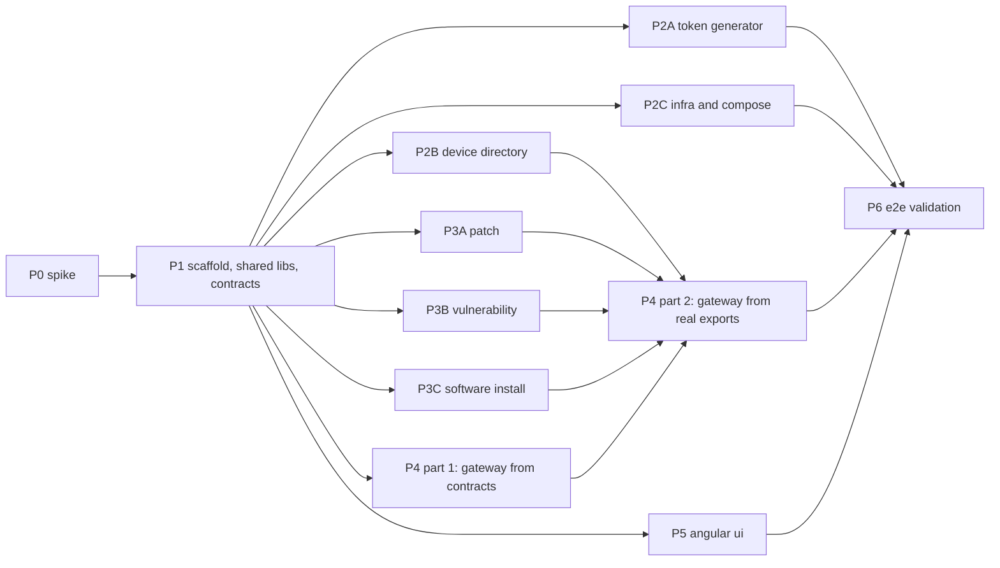

# Execution Plan — Federated GraphQL POC

Companion to [`../federated-graphql-poc-plan.md`](../federated-graphql-poc-plan.md) (v3). The plan says *what* and *why*. The files in this folder say *how*, one file per phase, written so an agent can pick up a phase and finish it without further context.

## 1. How to use these documents

1. Read the plan (v3) once, in full. Every phase document assumes it.
2. Read this file for the dependency graph, lanes, file ownership, and operating rules.
3. Read `docs/version-facts.md` (produced by Phase 0). **If it conflicts with a phase document, version-facts wins.** Phase documents were written before the exact Hot Chocolate / Fusion version was pinned. Anything marked `⚠️ VERIFY` is a best-known form that the spike confirms or corrects.
4. Read `contracts/` (produced by Phase 1). Contracts are frozen after Phase 1; see §6 for the change procedure.
5. Do your phase. Every phase ends with a Definition of Done checklist. Do not report completion until every item is true.

## 2. Phase index

| ID | File | Produces | Depends on | Lane | Effort |
|---|---|---|---|---|---|
| P0 | `phase-0-spike.md` | `docs/version-facts.md`, `tests/fixtures/*.json`, go/no-go on Fusion v2 | — | sequential | 1–2 d |
| P1 | `phase-1-scaffold-and-shared-libs.md` | solution, version pins, `src/Shared.Seeding`, `src/Shared.Auth`, `contracts/`, script + CI skeletons | P0 | sequential | 1–2 d |
| P2A | `phase-2a-token-generator.md` | `src/TokenGenerator`, `users.json`, `tokens.json` | P1 | A | 0.5 d |
| P2B | `phase-2b-device-directory-subgraph.md` | `src/DeviceDirectory` + tests + `schemas/device-directory.graphqls` | P1 | B | 1.5–2 d |
| P2C | `phase-2c-infra-and-compose.md` | `docker-compose.yml`, `infra/`, Dockerfile template, `scripts/up.sh`, demo scripts | P1 | A | 1 d |
| P3A | `phase-3a-patch-subgraph.md` | `src/Patch` + tests + `schemas/patch.graphqls` | P1 | C | 1.5–2 d |
| P3B | `phase-3b-vulnerability-subgraph.md` | `src/Vulnerability` + tests + `schemas/vulnerability.graphqls` | P1 | D | 1.5–2 d |
| P3C | `phase-3c-softwareinstall-subgraph.md` | `src/SoftwareInstall` + tests + `schemas/software-install.graphqls` | P1 | E | 1.5–2 d |
| P4 | `phase-4-gateway-and-composition.md` | `src/Gateway`, `scripts/compose-schema.sh`, `scripts/check-schema-drift.sh`, `gateway/gateway.far` | Part 1: P1. Part 2: P2B + P3A + P3B + P3C | B | 1–2 d |
| P5 | `phase-5-angular-ui.md` | `ui/` (Angular app + Nginx image) | P1 (contracts include the `tokens.json` shape) | F | 3–4 d |
| P6 | `phase-6-e2e-validation.md` | `scripts/e2e.sh`, `docs/demo.md`, `docs/e2e-report.md` | everything | sequential | 1–2 d |

## 3. Dependency graph



## 4. Execution sequence

### Stage 0 — sequential: P0 only
One agent. Nothing else starts. **Gate:** `docs/version-facts.md` complete (all eight sections filled), five fixture JSON files committed, Fusion v2 / v1 decision recorded.

### Stage 1 — sequential: P1 only
One agent. **Gate:** `dotnet build` and `dotnet test` green on the scaffold, `contracts/` committed and tagged `contracts-v1`, every project in the solution pre-created (even if empty) so later lanes never touch `SoR.sln`.

### Stage 2 — parallel fan-out
Start all of P2A, P2B, P2C, P3A, P3B, P3C, P4 part 1, P5 at once. Up to eight agents; two is the practical minimum. Each lane only writes inside the paths it owns (§5).

**Checkpoint TB (tracer bullet)** — reached as soon as P2A, P2B, P2C and P4 part 1 are merged, regardless of the domain lanes:

```bash
docker compose up --build -d postgres device-directory fusion-gateway token-generator angular-ui
scripts/wait-healthy.sh device-directory fusion-gateway
TOKEN=$(docker compose run --rm -T token-generator --user alice)
curl -s http://localhost:5000/graphql -H "Authorization: Bearer $TOKEN" -H 'Content-Type: application/json' \
  -d '{"query":"{ device(id:\"dev-00001\") { id hostname patchEvents { id } } }"}' | jq .
```
Expected: `data.device` populated from Postgres, `patchEvents` is `null` with an error at `["device","patchEvents"]` (the Patch subgraph does not exist yet). That proves federation, edge auth, header forwarding and degradation before a single domain subgraph exists. **Reach this checkpoint as early as possible.** It surfaces integration problems while the domain lanes still have time to react.

### Stage 3 — sequential: P4 part 2
After all four subgraph lanes are merged: run `scripts/compose-schema.sh`, commit `schemas/*.graphqls` and `gateway/gateway.far`, confirm `scripts/check-schema-drift.sh` passes. Owner: the P4 agent.

### Stage 4 — P5 integration
The UI lane switches from fixtures to the live stack, fixes any mismatch, and re-runs its tests. Owner: the P5 agent.

### Stage 5 — sequential: P6
Fresh clone, single command, scripted assertions, manual UI checklist, demo script, sign-off.

## 5. Staffing options

| Agents | Lane assignment | Wall-clock estimate |
|---|---|---|
| 1 | P0 → P1 → P2A → P2C → P2B → P4.1 → checkpoint TB → P3A → P3B → P3C → P4.2 → P5 → P6 | 14–18 d |
| 2 | Agent 1: P0 → P1 → P2B → P4.1 → P3A → P4.2. Agent 2 (from Stage 2): P2A → P2C → P5, then P3B → P3C. Both: P6 | 9–11 d |
| 5 (recommended) | A: P2A → P2C → later helps P6. B: P2B → P4.1 → P4.2. C: P3A. D: P3B. E: P3C. F (can be A after P2C): P5 | 6–8 d |
| 8 | one lane each, P4 and P5 start on day 1 of Stage 2 | 5–7 d |

## 6. File ownership

A lane may only create or edit paths it owns. Everything else is read-only for that lane. This is what makes the fan-out safe to merge.

| Path | Owner | Others may |
|---|---|---|
| `docs/version-facts.md` | P0 | append entries under "§8 Deviations" only |
| `tests/fixtures/*.json` | P0 | read; P5 copies them into `ui/src/testing/fixtures/` |
| `SoR.sln`, `global.json`, `Directory.Build.props`, `.config/dotnet-tools.json`, `.editorconfig` | P1 | nothing |
| `Directory.Packages.props` | P1 | **append** one `PackageVersion` line with a `<!-- P3A -->` style comment; never change an existing version |
| `src/Shared.Seeding`, `src/Shared.Auth`, their tests | P1 | bug-fix PRs only; all existing tests must stay green |
| `contracts/` | P1 | nothing without the §7 procedure |
| `.env`, `docker-compose.yml`, `infra/`, `scripts/up.sh`, `scripts/wait-healthy.sh`, `scripts/demo-*.sh`, `.dockerignore` | P2C | nothing; request changes by issue |
| `src/TokenGenerator`, `tests/TokenGenerator.Tests`, `src/TokenGenerator/users.json` | P2A | nothing |
| `src/DeviceDirectory`, `tests/DeviceDirectory.Tests`, `schemas/device-directory.graphqls` | P2B | nothing |
| `src/Patch`, `tests/Patch.Tests`, `schemas/patch.graphqls` | P3A | nothing |
| `src/Vulnerability`, `tests/Vulnerability.Tests`, `schemas/vulnerability.graphqls` | P3B | nothing |
| `src/SoftwareInstall`, `tests/SoftwareInstall.Tests`, `schemas/software-install.graphqls` | P3C | nothing |
| `src/Gateway`, `tests/Gateway.Tests`, `gateway/`, `scripts/export-schemas.sh`, `scripts/compose-schema.sh`, `scripts/check-schema-drift.sh` | P4 | nothing |
| `ui/` | P5 | nothing |
| `scripts/e2e.sh`, `docs/demo.md`, `docs/e2e-report.md` | P6 | nothing |
| `README.md` | P1 creates; P6 finalises | one-line additions per lane describing how to run its tests |

Each subgraph lane owns its own `Dockerfile` inside its `src/<Name>/` folder. P2C provides the template and the compose service entry; the lane must satisfy the HTTP contract (`contracts/http-and-env.md`) so the compose entry works unchanged.

## 7. Contract change procedure

Contracts are frozen at the end of P1 (git tag `contracts-v1`). A change requires:

1. An issue stating what changes, why, and which lanes are affected.
2. One PR that edits `contracts/` **and** notifies the owners of every affected lane in the PR description.
3. Tag `contracts-v2` on merge. P4 and P5 re-check against the new tag.

Avoid changes. The contracts were designed so that the domain subgraphs, gateway and UI can be built in isolation. Almost every "I need to change the contract" turns out to be solvable inside the lane.

## 8. Agent operating rules

- **Branch** `phase/<id>-<slug>` (e.g. `phase/3a-patch`). PR into `main`, squash merge, PR title starts with the phase ID.
- **Never edit outside owned paths** (§6). If you need something from another lane, open an issue and stub locally.
- **Build clean.** `Directory.Build.props` turns warnings into errors. Do not suppress warnings globally to get past this; fix them or suppress the single line with a comment.
- **Tests must pass locally** with `dotnet test` (unit) and, where the phase has them, integration tests that use Testcontainers (Docker required). Do not mark integration tests `Skip` to get green.
- **Record deviations.** If reality differs from the phase document (an API name, a command flag, a behaviour), append to `docs/version-facts.md §8 Deviations` in the same PR: what the document said, what is true, what you did.
- **Do not change nullability of the three extension fields.** `patchEvents`, `vulnerabilityEvents`, `installEvents` are nullable lists. A schema test in each domain subgraph enforces this; do not edit the test.
- **Determinism.** No `DateTime.UtcNow`, `Guid.NewGuid()` or unseeded `Random` in seed code. Everything derives from `SeedConstants.Epoch` and `DeterministicRandom`.
- **Secrets.** There are none; the JWT key is dev-only and committed in `.env`. Do not "improve" this with secret management.
- **Docker hygiene.** `docker compose down` between runs is fine. `docker compose down -v` deletes seeded data and forces a full reseed on next start; only do this when you need to test seeding.
- **Definition of Done** is per phase. Report completion only when every checkbox is true, and list any that are not with the reason.

## 9. Integration checkpoints and their commands

| Checkpoint | When | Command | Pass condition |
|---|---|---|---|
| Scaffold green | end of P1 | `dotnet build && dotnet test --filter Category!=Integration` | exit 0 |
| Contract compose | P4 part 1 | `scripts/compose-schema.sh --from-contracts` | `gateway/gateway.far` produced, gateway starts, `/health` 200 |
| Tracer bullet | P2A+P2B+P2C+P4.1 merged | §4 Stage 2 block | `data.device` non-null, `patchEvents` null with error |
| Full compose | P4 part 2 | `scripts/compose-schema.sh && scripts/check-schema-drift.sh` | drift check exit 0 |
| Stack up | before P5 integration | `scripts/up.sh` | all services healthy within 5 min on a cold start |
| E2E | P6 | `scripts/e2e.sh` | all scenarios PASS |
